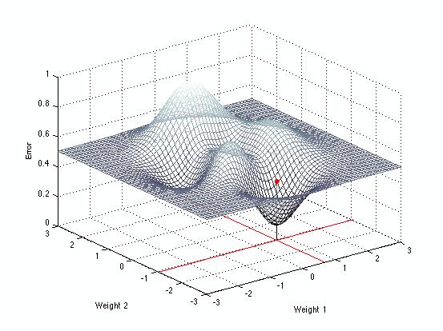

GDDEMO runs a little demonstration of [gradient
descent](http://en.wikipedia.org/wiki/Gradient_descent) in Matlab.  Just clone
this repository, launch Matlab, and open and run <b>gddemo</b> to get started.
Click in the space above the error surface to drop a ball onto it.  Ball
descends gradient using local search (negative hill-climbing), after which
final weights are shown by intersecting lines on axes.  Click on the axes below
the error surface to show the error at the corresponding weights.  You can
write your own <tt>errfun.m</tt> if you want a different error function.  

